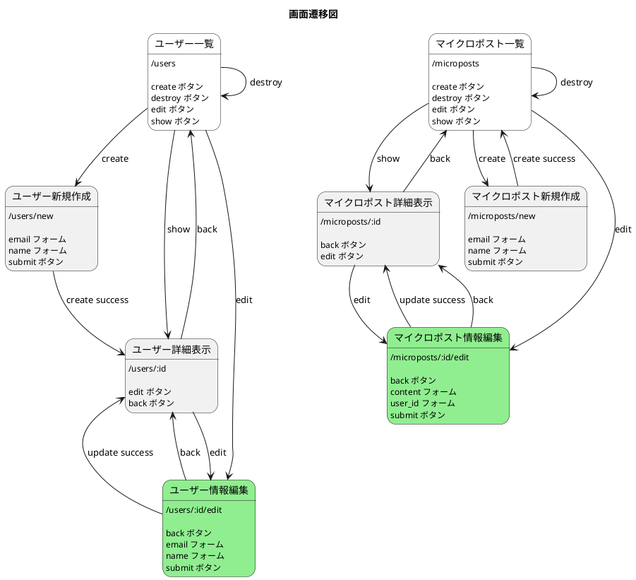

#ToyApp モデル関係図

 

```plantuml

@startuml
title
画面遷移図
end title

state ユーザー一覧#fff
ユーザー一覧: /users
ユーザー一覧:
ユーザー一覧:create ボタン
ユーザー一覧:destroy ボタン
ユーザー一覧:edit ボタン
ユーザー一覧:show ボタン

ユーザー詳細表示: /users/:id
ユーザー詳細表示:
ユーザー詳細表示: edit ボタン
ユーザー詳細表示: back ボタン

ユーザー新規作成: /users/new
ユーザー新規作成:
ユーザー新規作成:email フォーム
ユーザー新規作成:name フォーム
ユーザー新規作成:submit ボタン

state ユーザー情報編集#lightgreen
ユーザー情報編集:/users/:id/edit
ユーザー情報編集:
ユーザー情報編集:back ボタン
ユーザー情報編集:email フォーム
ユーザー情報編集:name フォーム
ユーザー情報編集:submit ボタン

ユーザー一覧-->ユーザー一覧: destroy
ユーザー一覧-->ユーザー詳細表示: show
ユーザー一覧-->ユーザー新規作成: create
ユーザー一覧-->ユーザー情報編集: edit

ユーザー詳細表示-->ユーザー一覧: back
ユーザー詳細表示-->ユーザー情報編集: edit

ユーザー情報編集-->ユーザー詳細表示: update success
ユーザー情報編集-->ユーザー詳細表示: back

ユーザー新規作成-->ユーザー詳細表示: create success

state マイクロポスト一覧#FFF
マイクロポスト一覧: /microposts
マイクロポスト一覧:
マイクロポスト一覧:create ボタン
マイクロポスト一覧:destroy ボタン
マイクロポスト一覧:edit ボタン
マイクロポスト一覧:show ボタン

マイクロポスト詳細表示: /microposts/:id
マイクロポスト詳細表示:
マイクロポスト詳細表示: back ボタン
マイクロポスト詳細表示: edit ボタン

マイクロポスト新規作成:/microposts/new
マイクロポスト新規作成:
マイクロポスト新規作成:email フォーム
マイクロポスト新規作成:name フォーム
マイクロポスト新規作成:submit ボタン

state マイクロポスト情報編集#lightgreen
マイクロポスト情報編集: /microposts/:id/edit
マイクロポスト情報編集:
マイクロポスト情報編集:back ボタン
マイクロポスト情報編集:content フォーム
マイクロポスト情報編集:user_id フォーム
マイクロポスト情報編集:submit ボタン


マイクロポスト一覧-->マイクロポスト一覧: destroy
マイクロポスト一覧-->マイクロポスト新規作成: create
マイクロポスト一覧-->マイクロポスト情報編集: edit
マイクロポスト一覧-->マイクロポスト詳細表示: show

マイクロポスト詳細表示-->マイクロポスト情報編集: edit
マイクロポスト詳細表示-->マイクロポスト一覧: back

マイクロポスト情報編集-->マイクロポスト詳細表示: update success
マイクロポスト情報編集-->マイクロポスト詳細表示: back

マイクロポスト新規作成-->マイクロポスト一覧: create success

@enduml
```
