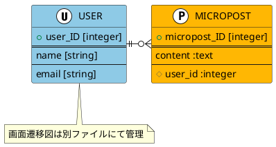

## ER図

```plantuml
@startuml
!define MAIN_ENTITY #8ecae6
!define MAIN_ENTITY_2 #ffb703

!define MASTER_MARK_COLOR FFF

    entity "USER" as user <<U,MASTER_MARK_COLOR>> MAIN_ENTITY {
        + user_ID [integer]
        ==
        name [string]
        --
        email [string]
    }

    entity "MICROPOST"  as post <<P,MASTER_MARK_COLOR>> MAIN_ENTITY_2{
        + micropost_ID [integer]
        ==
        content :text
        --
        # user_id :integer
    }

user  ||-ri-o{  post
note bottom of user :画面遷移図は別ファイルにて管理
@enduml
```
