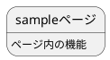
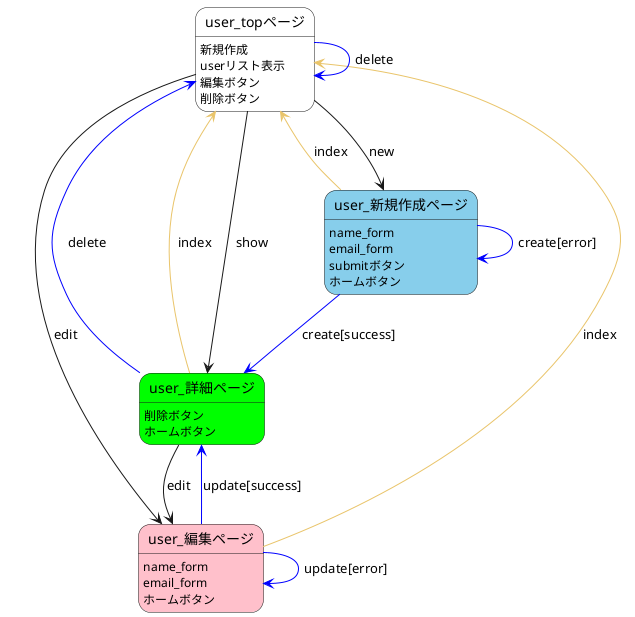
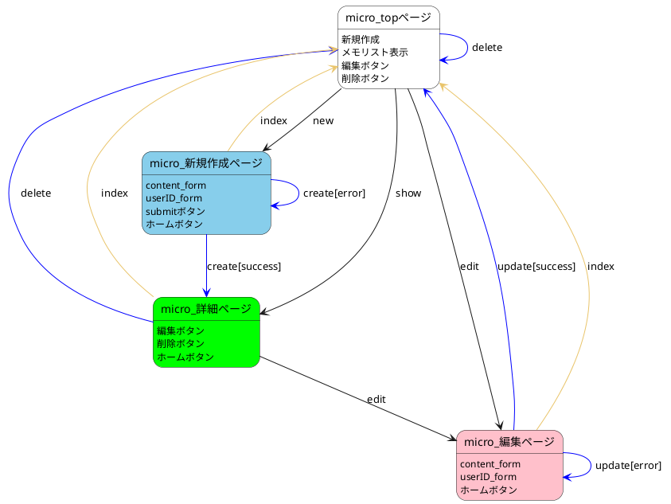

# 画面遷移図
## 構成

```plantuml
@startuml
state sampleページ
sampleページ: ページ内の機能
@enduml
```
## user

```plantuml
@startuml 
state user_topページ #FFFFFF
user_topページ: 新規作成
user_topページ: userリスト表示
user_topページ: 編集ボタン
user_topページ: 削除ボタン

state user_詳細ページ #00FF00
user_詳細ページ: 削除ボタン
user_詳細ページ: ホームボタン

state user_新規作成ページ #Skyblue
user_新規作成ページ: name_form
user_新規作成ページ: email_form
user_新規作成ページ: submitボタン
user_新規作成ページ: ホームボタン

state user_編集ページ #Pink
user_編集ページ: name_form
user_編集ページ: email_form
user_編集ページ: ホームボタン

user_topページ--> user_詳細ページ: show
user_topページ--> user_新規作成ページ : new
user_topページ--> user_編集ページ : edit
user_topページ-[#0000FF]->user_topページ: delete

user_新規作成ページ-[#0000FF]->user_詳細ページ: create[success]
user_新規作成ページ-[#0000FF]->user_新規作成ページ: create[error]
user_新規作成ページ-[#e9c46a]->user_topページ: index

user_詳細ページ-->user_編集ページ: edit
user_詳細ページ-[#0000FF]->user_topページ: delete
user_詳細ページ-[#e9c46a]->user_topページ: index

user_編集ページ-[#0000FF]->user_詳細ページ: update[success]
user_編集ページ-[#0000FF]->user_編集ページ: update[error]
user_編集ページ-[#e9c46a]->user_topページ: index
@enduml
```
## micro_post

```plantuml
@startuml
state micro_topページ #FFFFFF
micro_topページ: 新規作成
micro_topページ: メモリスト表示
micro_topページ: 編集ボタン
micro_topページ: 削除ボタン

state micro_詳細ページ #00FF00
micro_詳細ページ: 編集ボタン
micro_詳細ページ: 削除ボタン
micro_詳細ページ: ホームボタン

state micro_新規作成ページ #Skyblue
micro_新規作成ページ: content_form
micro_新規作成ページ: userID_form
micro_新規作成ページ: submitボタン
micro_新規作成ページ: ホームボタン

state micro_編集ページ #Pink
micro_編集ページ: content_form
micro_編集ページ: userID_form
micro_編集ページ: ホームボタン

micro_topページ--> micro_詳細ページ: show
micro_topページ--> micro_新規作成ページ : new
micro_topページ--> micro_編集ページ : edit
micro_topページ-[#0000FF]->micro_topページ: delete

micro_新規作成ページ-[#0000FF]->micro_詳細ページ: create[success]
micro_新規作成ページ-[#0000FF]->micro_新規作成ページ: create[error]
micro_新規作成ページ-[#e9c46a]->micro_topページ: index

micro_詳細ページ-->micro_編集ページ: edit
micro_詳細ページ-[#0000FF]->micro_topページ: delete
micro_詳細ページ-[#e9c46a]->micro_topページ: index

micro_編集ページ-[#0000FF]->micro_topページ: update[success]
micro_編集ページ-[#0000FF]->micro_編集ページ: update[error]
micro_編集ページ-[#e9c46a]->micro_topページ: index

@enduml
```